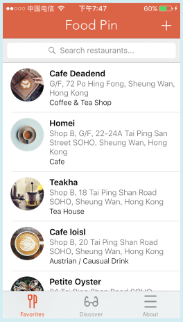

# FoodPinDemo
My exercises while reading the appcoda book.



## Some notes
see commit history for details.

### 基本操作1
1. change cell style from basic to custom.
2. change table view row height from default(44) to 80
3. change cell row height to 80 (只要勾上custom会自动变成80)
4. drag an image view to the cell (14,10) 60*60
5. Add 3 labels: Name(Headline), Location(Light, 14, Dark Gray), Type(Light, 13)
6. Stackview the 3 labels, spacing: 0 -> 1
7. Stackview the image and above stackview, spacing: 0 -> 10, Alignment: Top
8. 设置最外层的stack view 和cell边距的上左下右分别为2, 6, 1.5, 0这时stackview会填充整个cell, 但是图片被横向拉伸了
9. 在outline中ctrl水平拖动image view到自身, 设置width和height为60

### 基本操作2
1. 在outline的tableviewCell上点右键可以看到这个cell中定义的所有outlet
2. UIKit中所有View都自带CALayer, 这个layer对象可以控制view的背景色,边框, 透明度, 圆角


### 设置圆角:

```swift
cell.thumbnailImageView.layer.cornerRadius = 30.0
cell.thumbnailImageView.clipsToBounds = true                                                                                             
```
或者选中image view在identity inspector中新增一个runtime属性layer.cornerRadius值为Number:30
并在attributes inspector中勾选clip to bounds


### 自适应大小的cell
1. 将Value label的Lines从1改成0, 这样Label可以显示多行文字
2. tableView.estimatedHeight改成它的预计行高值(36/44), 以优化性能, 默认值是0
3. tableView.rowHeight = UITableViewAutomaticDimension, 从iOS10开始, 这已经是默认值
4. 这时console会有个layout warning, 解决办法是给这个cell中包含的那个stack view设置top和bottom约束(之前已经给它设定了leading/trailing和center vertically的约束,但是对于自适应大小的cell来说还不够)


### 美化tableview/表格线
```swiftv
//roration margin
self.tableView.cellLayoutMarginsFollowReadableWidth = true
// set table view bg color
tableView.backgroundColor = UIColor(white: 240.0/255, alpha: 0.2)
// remove empty rows
tableView.tableFooterView = UIView(frame: CGRect.zero)
//set separator color
tableView.separatorColor = UIColor(white: 240.0/255, alpha: 0.8)

```

## 美化nav bar
Configure the appearance of the navigation bar using the navigationBar property on the UINavigationController object.
Control the content of the navigation bar by setting the title and navigationItem properties on each UIViewController you push onto the navigation controller’s stack

1)
// global setting.
在didFinishLaunchingWithOptions设置nav bar的返回button item外观
UINavigationBar.appearance().backIndicatorImage = backIndicator
UINavigationBar.appearance().backIndicatorTransitionMaskImage = backIndicator

```swift
//big title
self.navigationController?.navigationBar.prefersLargeTitles = true

// nav bar bg color
UINavigationBar.appearance().barTintColor = UIColor(red: 216.0/255, green: 74.0/255, blue: 32.0/255, alpha: 1.0)

// nav bar button style(可以点击的)
UINavigationBar.appearance().tintColor = UIColor.white

// nav title style
if let barFont = UIFont(name: "Avenir-Light", size: 24.0) {

UINavigationBar.appearance().titleTextAttributes = [NSForegroundColorAttributeName: UIColor.white, NSFontAttributeName: barFont]
}
```
Navbar的背景色为UINavigationBar.appearance().barTintColor, 但是它还有一个backgroundColor属性,呃.

2) 在segue.source这边viewDidLoad中重新定义后退按钮(不带文字)

```swift
navigationItem.backBarButtonItem = UIBarButtonItem(title: "", style: .plain, target: nil, action: nil)
```

3) 在detail view的viewDidLoad中设置nav bar title

```swift
title = restaurant.name
```
4) 全透明navigation bar
navigationController?.navigationBar.setBackgroundImage(UIImage(), for: .default)
navigationController?.navigationBar.shadowImage = UIImage()
navigationController?.navigationBar.isTranslucent = true

5) 全局修改nav bar返回导航图片
let backIndicator = UIImage(named: "back")
UINavigationBar.appearance().backIndicatorImage = backIndicator
UINavigationBar.appearance().backIndicatorTransitionMaskImage = backIndicator


## 美化status bar
修改status bar黑色文字为白色, 两种方式:
1) ViewController逐个修改, 覆盖preferredStatusBarStyle方法即可(.lightContent), 如果当前的ViewController被嵌套在Navigation Controller中，
需要重载Navigation Controller中的preferredStatusBarStyle
 open override var preferredStatusBarStyle: UIStatusBarStyle{
    return topViewController?.preferredStatusBarStyle ?? .default
}

2) 全局修改
1. Info.plist设置`View controller-based status bar appearance=NO`
2. AppDelegate中`UIApplication.shared.statusBarStyle = .lightContent`


## 添加地图功能
1) MKMapView控件提供地图功能
2) CLGeocoder提供文本地址和经纬度地址相互转换功能, CLGeocoder.geocodeAddressString 和 CLGeocoder.reverseGeocodeLocation
3) 通过经纬度地址（CLPlacemark）构造地点指示器data（MKPointAnnotation）
4） MKMapView.addAnnotation()添加默认样式地点指示器，MKMapView.setRegion 或 MKMapView.selectAnnotation 缩放到指定区域或地点
5) 自定义地点指示器样式,需要conform MKMapViewDelegate protocol并实现 mapView(_ mapView: MKMapView, viewFor annotation: MKAnnotation) -> MKAnnotationView?函数， 返回自定义的MKAnnotationView对象


## 添加简单动画
1) 设置UIview对象添加动画属性的初始状态(position, scale, rotation, alpha)等等
2) 通过UIView.animate(withDuration: , animations: ) UIView.animate(withDuration: , delay: , options: , animations: , completion: )接口给动画对象指定动画结束状态，动画时长等等。
3）CGAffineTransform表示一个仿射变换（平移，旋转，缩放）,CGAffineTransform.concatenating() combine两个变换

Spring动画(UIView.animate多加些参数)

```swift
UIView.animate(withDuration: 0.3, delay: 0.0, usingSpringWithDamping: 0.3, initialSpringVelocity: 0.2, options: .curveEaseOut, animations: {
self.containerView.transform = CGAffineTransform.identity
}, completion: nil)
```

## 使用CoreData
1) 创建项目时勾选使用CoreData或手动添加xcdatamodeld文件以及创建NSPersistentContainer实例。
2）Fetching Data Records
    let fetchRequst: NSFetchRequest<YourDataModel> = YourDataModel.fetchRequest()
    do {
        try dataFetchResult = appDelegate.persistentContainer.viewContext.fetch(fetchRequst)
    }catch {
        fatalError("Fetch core data error: \(error)")
    }
### 使用NSFetchedResultsController优化Fetched Objects管理（当发生变化add,insert,delete,move变化时，通知NSFetchedResultsControllerDelegate）
1)创建NSFetchedResultsController实例：
	let sortByNameDescpritor = NSSortDescriptor(key: "name", ascending: true)
	let fetchRequest: NSFetchRequest<YourDataModel> = YourDataModel.fetchRequest()
	fetchRequest.sortDescriptors = [sortByNameDescpritor]
	let fetchReslutController = NSFetchedResultsController(fetchRequest: fetchRequest,
	                                                    managedObjectContext: appDelegate.persistentContainer.viewContext,
	                                                    sectionNameKeyPath: nil,
	                                                    cacheName: nil)
	fetchReslutController.delegate = YourDelegate
2)使用fetchReslutController Fetch Data Records:
	do {
	    try restaurantDataFetchResultController?.performFetch()
	} catch {
	    print("Fetch Data Error: \(error.localizedDescription)")
	}

	if let fetchResult = restaurantDataFetchResultController?.fetchedObjects {
	    self.allRestaurant = fetchResult
	}
3)fetchReslutController 通知Delegate Managed Objec的变化
    func controllerWillChangeContent(_ controller: NSFetchedResultsController<NSFetchRequestResult>) 
    func controller(_ controller: NSFetchedResultsController<NSFetchRequestResult>,
                    didChange anObject: Any,
                    at indexPath: IndexPath?,
                    for type: NSFetchedResultsChangeType,
                    newIndexPath: IndexPath?)
    
    func controllerDidChangeContent(_ controller: NSFetchedResultsController<NSFetchRequestResult>)

3) Save Data Record
    guard let appDelegate = UIApplication.shared.delegate as? AppDelegate else {
    }
    let newRecord = YourDataModel(context: appDelegate.persistentContainer.viewContext)
	newRecord.key_1 = val_1
	newRecord.key_2 = val_2
	...
    appDelegate.saveContext()
4) Delete Data Record
	let managedObjectContext = appDelegate.persistentContainer.viewContext
	managedObjectContext.delete( DataModelToDelete )
	appDelegate.saveContext()
5) Update Data Record
   	YourRecord.key_1 = new_val1
	YourRecord.key_2 = new_val2
	...
	appDelegate.saveContext()

## 使用UISearchController添加搜索框
1）可将UISearchController添加到NavigationBar或UITableView的HeaderView区域，或其他地方。
    let searchController = UISearchController(searchResultsController: nil)
    searchController.searchResultsUpdater = YourUISearchResultsUpdatingDelegate
    YourViewController.navigationItem.searchController = searchController
    YourViewController.tableView.tableHeaderView = searchController?.searchBar

2)Conform UISearchResultsUpdating protocol 实现搜索筛选逻辑
extension YourViewController: UISearchResultsUpdating {
    func updateSearchResults(for searchController: UISearchController) 
}

3)通过searchController.isActive 动态使用筛选列表或是完整列表填充TableView
override func tableView(_ tableView: UITableView, numberOfRowsInSection section: Int) -> Int {
    return (self.searchController?.isActive  ?? false) ? searchRestaurant.count : allRestaurant.count
}
override func tableView(_ tableView: UITableView, cellForRowAt indexPath: IndexPath) -> UITableViewCell {
    let cell = tableView.dequeueReusableCell(withIdentifier: "restaurantCell", for: indexPath) as! RestaurantTableViewCell
    let cellData = (self.searchController?.isActive ?? false) ? searchRestaurant[indexPath.row] : allRestaurant[indexPath.row]
    cell.initByData(cellData)
    return cell
}


